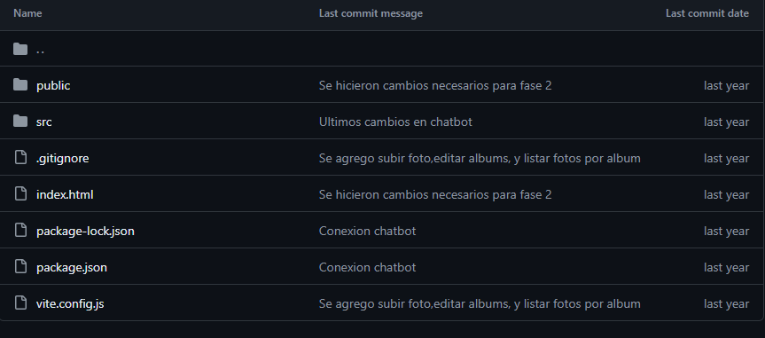
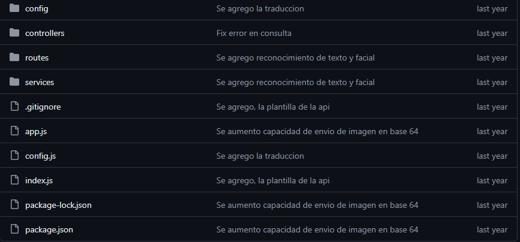
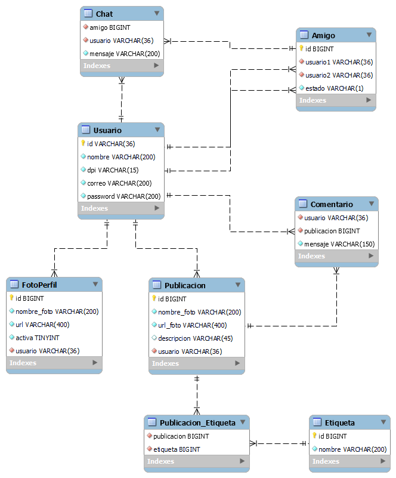
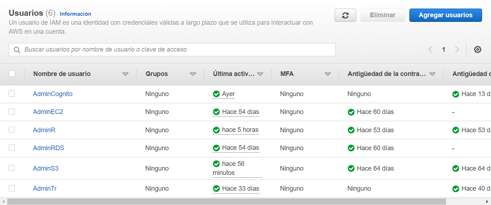
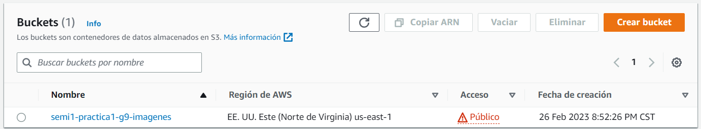
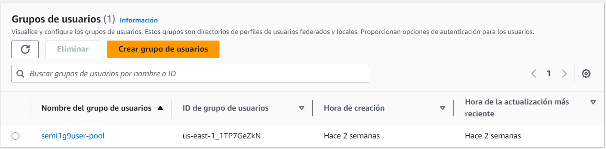

# PhotoBucket

Aplicación web donde los usuarios inician sesión para subir fotos y separarlas en álbumes que se generan automáticamente mediante AWS Rekognition en base a las fotos subidas. El manejo de usuarios se administra gracias a Cognito, y se da la opción de iniciar sesión mediante reconocimiento facial. Se utilizó Amazon Lex para un chatbot básico y funciones Lambda para traducir comentarios.

## __Frontend__

Para el FrontEnd se utilizo el framework de javaScript React utilizando VITE para su configuración. Para consumir las API Rest Node Js. Se creó una imagen de docker para poder ejecutarlo posteriormente con docker compose.

## __Backend__

### __NodeJS__
Para la api se utilizo como lenguaje nodejs utilizando express, morgan y cors para su configuración. Para la conexión a aws se utilizó aws-sdk, para la conexión a la base de datos se utilizó mysql2 y para leer el .env se utilizó dotenv. Para la seguridad se implemento JWT para la verificación de permisos e inicio de sesión enlazada con cognito. Para encriptación se utilizó md5. Se creó una imagen de docker para poder ejecutarlo posteriormente con docker compose.

### __Endpoints__

* __/registrar-usuario__
Permite crear un nuevo usuario ingresando nombre, dpi, correo, contraseña, nombre de foto, imagen de la foto. Se utiliza el correo y la contraseña para ingresarlos al pool de usuarios de Amazon Cognito y el resto de la información se ingresa a la base de datos.

* __/verificar-cuenta__
Permite confirmar el correo electronico de una cuenta registrada en la aplicación. Recibe el correo electronico y un codgio numerico enviado al correo del usuario. 

* __/iniciar-sesion__
Permite generar un token para el inicio de sesión en la aplicación. Recibe un correo y contraseña los cuales se verifican desde cognito.

* __/verificar-token__
Permite verificar si el token que se envia es valido y permite su autorización.

* __/iniciar-sesion-foto__
Recibe una foto la cual se compara con las fotos de perfil mediante rekognition y permite iniciar sesión generando su token respectivo.

* __/get-fotos-perfil__
Permite obtener las fotos de perfil de un usuario especifico.

* __/subir-foto__
Permite subir una publicación en el perfil de un usuario en especifico.

* __/get-publicacion-todo__
Permite obtener todas las publicaciones de un usuario en especifico.

* __/get-publicacion/:etiqueta__
Permite obtener las publicaciones de un usuario en especifico filtrando por una etiqueta en especifico.

* __/listar-desconocidos__
Permite mostrar una lista de todos los usuarios que no son amigos de un usuario especifico.

* __/agregar-amigo__
Permite enviar una solicitud de amistad de un usuario a otro.

* __/solicitudes-amistad__
Permita listar todas las solicitudes de amistad pendientes de un usuario en especifico.

* __/rechazar-amistad/:solicitud__
Permite rechazar una solicitud amistad.

* __/aceptar-amistad/:solicitud__
Permite aceptar una solicitud de amistad.

* __/publicaciones-amigos__
Permite obtener todas las publicaciones hechas por los amigos de un usuario en especifico.

* __/get-info-perfil__
Permite obtener toda la información que ingresó en su registro un usuario en especifico.

* __/modificar-datos__
Permite modificar el nombre y dpi de un usuario en especifico.

* __/foto-perfil-nueva__
Permite cambiar la foto de perfil de un usuario subiendo una foto nueva a la aplicación.

* __/foto-perfil-existente__
Permite cambiar la foto de perfil de un usuario por una que ya ha sido subida a la aplicación.

* __/chatbot__
Permite enviar un mensaje al servicio de amazon lex.

* __/chatbot/aviso__
Permite notificar al usuario que su clase esta por empezar.

* __/get-comentario/:publicacion__
Permite al usuario obtener todos los comentarios de un publicacion especifica.

* __/comentario__
Permite al usuario crear un comentario en una publicacion especifica.

## __Base de Datos__
La base de datos se implemento utilizando MySQL como gestor y ejecución dentro de un contenedor de docker. 

* Diagrama de la base de datos:

## __AWS__

### __Usuarios IAM__

* __AdminS3:__ Usuario para la administración del servicio Amazon S3 implementado para el almacenamiento de las fotografías de las publicaciones,  utiliza la política AmazonS3FullAccess que brinda acceso completo a S3 y S3 lamda. 

* __AdminEC2:__ Usuario utilizado para la administración de Amazon EC2, se utilizó para configurar las EC2 que ejecutan el frontend, backend y la base de datos por medio de contenedores de docker. también se utilizó para configurar el loadBalancer. Utiliza la politica de AmazonEC2FullAccess.

* __AdminR:__ Usuario utilizado para la administración de Amazon Rekognition, se utilizo para acceder al servicio de rekognition para sacar las etiquetas y la comparación de rostros de las fotografias. Utiliza la Política RekognitionFullAccess.

* __AdminTr:__ Usuario utilizado para la administración de Amazon Translate, se utilizo para acceder al servicio translate para traducir los textos de las descripciones. Utiliza la Política TranslateFullAccess.

* __AdminCB:__ Usuario utilizado para la administración de Amazon Lex, se utilizo para acceder al servicio de amazonLex y poder usar los bots que nos brindan. Utiliza la Política AmazonLexFullAccess.

* __AdminCognito:__ Usuario utilizado para la administración y acceso a Amazon Cognito para configurar el pool de usuarios para manejar los credenciales de acceso a la aplicación. 

### __Despliegue y Servicios__

* __Amazon EC2__

    Para el despliege del proyecto se utilizaron dos instancias de EC2. La primera instancia se utilizo para la base de datos mysql ejecutada por medio de docker y la segunda instancia se ejecuta el backend y el frontend igualmente por medio docker.

* __Amazon S3__

    Se creo un bucket en Amazon S3 con el nombre semi1-practica1-g9-imagenes que contiene dos carpetas Fotos_Perfil y Fotos_Publicadas en las cuales se almacenan las fotografias de los usuarios.

    

* __Amazon Rekognition__

    Para el analisis de las fotos se utilizó este servicio. Se accede por medio de las credenciales de AdminR y recibe las fotos para analizarlas para obtener sus etiquetas como también para realizar una comparación de rostros para iniciar sesión por medio de una foto.

* __Amazon Translate__

    Se utilizá para la traducción de texto de un idioma origen a un idioma seleccionado. Se utilizó para traducir a diferentes idiomas las descripciones de las fotos ingresadas a la plataforma. Se accede por medio de las credenciales del usuario AdminTr

* __Amazon Lex__
    
    Se utiliza el chatbot que nos brinda este servicio. Se accede por medio de las credeciales de AdminCB y recibe un texto y este devuelve una respuesta dependiendo el texto que ingresemos. 

* __Amazon Cognito__

    Se utiliza para el manejo de credenciales de inicio de sesión. Se encarga de verificar que el correo ingresado a la plataforma sea valido y que al momento de intentar acceder el usuario y la contraseña sean correctos. Se implemento por medio del pool de usuarios semi1g9user-pool.

    

## __Pagina Web__

Proyecto grupal hecho por [mi persona (josuerobld)](https://github.com/josuerobld), [AlexIngGuerra](https://github.com/AlexIngGuerra), [AlexanderAvalos](https://github.com/AlexanderAvalos) y [jona1403](https://github.com/jona1403), mediante la metodología ágil SCRUM y gitflow como estrategia de branching. Donde **yo realice lo siguiente:**  
#### Frontend 
* Diseño y funcionalidad del login normal y mediante reconocimiento facial.
* Diseño y funcionalidad del registro de usuarios.
* Diseño de la pantalla de codigo de verificacion del correo.
* Diseño del dashboard principal.
* Diseño de nuevas publicaciones, ver comentarios.
* Diseño y funcionalidad de editar perfil de usuario.
* Diseño y funcionalidad de Enviar y ver solicitudes de usuarios.
* Diseño y funcionalidad de busqueda de imagenes por etiquetas.

#### Backend 
* Verificar el inicio de sesión mediante reconocimiento facial.
* Get-info-perfil que obtiene la información que el usuario ingresó en su registro.
* Arreglos en el endpoint de modificar datos del usuario registrado.
* Arreglos en el endpoint de cambio de todo de perfil del usuario.
* Mejoras al endpoint de obtener las fotos filtradas por las etiquetas de rekognition.

#### Amazon Web Services (AWS)
* Creación y configuración de la función lamnda en AWS para ejecutar el servicio de traducción.    
* Configuración del Bucket en S3 para el despliegue de la pagina del frontend. 
* Apoyo en la configuración del reconocimiento de imágenes mediante AWS rekognition. 
* Configuración de las instancias de EC2 para el despliegue del Backend y Frontend.  
* Configuración de Amazon Translate como servicio de traducción de comentarios. 